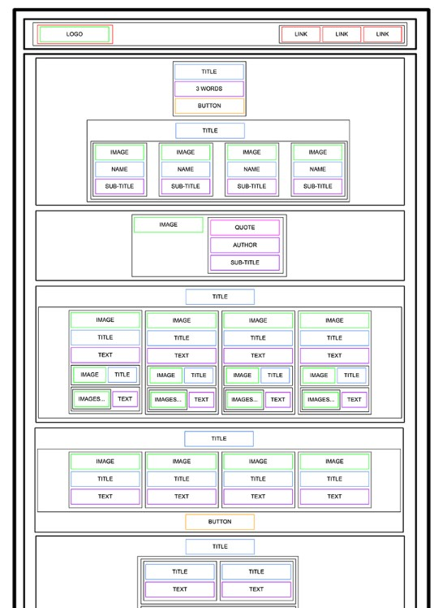

# Advanced HTML page #
Explore some advanced features of HTML, such as HTML layout.
### Overview
This is a static HTML web page from ALX task 1. the goal of it is to undrestand how these features works.

## Features in brief
1. Usersating HTML structure
2. Uderstand the deffrence between tag and elements
3. Walking with HTML 5 syntax

## Architecture

- alx_html_css
  - html_advanced
    - index.html
  - Readme.md

